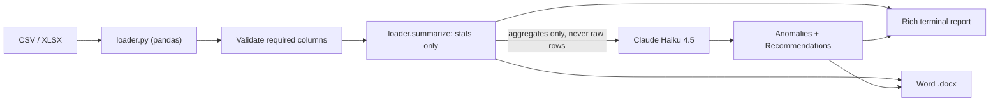

# Operations Report Generator

> Drop in a CSV or XLSX of factory data. Get a manager-ready Word report with KPIs, anomalies, and recommendations in under 10 seconds. Raw data stays on your machine.

[](https://www.python.org)
[](https://www.anthropic.com)
[](https://pandas.pydata.org)
[](https://typer.tiangolo.com)
[](https://python-docx.readthedocs.io)


## ✨ Features
- **Spreadsheet in, Word doc out.** Reads CSV or XLSX, writes a formatted `.docx` with KPIs, anomalies, and recommended actions.
- **Privacy-respecting.** Raw rows never leave your machine. Only aggregate statistics (mean, min, max, totals, defect rate) are sent to Claude.
- **Schema-validated input.** Requires the columns `date, units_produced, defects, downtime_hours, line_id, shift`. Missing columns fail fast with a clear error.
- **Mock mode by default.** Develop and demo without burning API credits. Flip `--no-mock` for real Claude calls.
- **Rich terminal preview + docx.** See the report in your terminal first, then a Word file lands on disk for sharing.

## 🏗 Architecture



The privacy boundary matters here. `loader.summarize` reduces the spreadsheet to a dictionary of aggregates before any network call. Whatever's in the rows (employee names, supplier IDs, anything regulated) stays local.

## 🛠 Stack
- Python 3.10+
- `pandas` + `openpyxl` for CSV and XLSX I/O
- `anthropic` SDK, Claude Haiku 4.5 by default
- `typer` for the CLI, `rich` for terminal output
- `python-docx` for the Word report
- `python-dotenv` for `.env` loading

## 🚀 Getting started

```bash
git clone https://github.com/tabetant/ops_report_generator.git
cd ops_report_generator

python -m venv .venv
source .venv/bin/activate
pip install -r requirements.txt

# Optional: set your Claude key for non-mock runs
echo "ANTHROPIC_API_KEY=sk-ant-..." > .env

# Mock run (default, no API call)
python main.py samples/factory_week.csv

# Real Claude call, custom output path
python main.py samples/factory_week.csv --no-mock --output reports/week-12.docx
```

Required columns in your file: `date`, `units_produced`, `defects`, `downtime_hours`, `line_id`, `shift`.

## 📁 Module layout

```
loader.py     # Load CSV/XLSX, validate schema, compute summary stats
analyzer.py   # Build prompt, call Claude (or mock), return anomalies + actions
output.py     # Rich terminal panels, python-docx Word writer
main.py       # Typer CLI entry point
samples/      # Example data files
```

## 📸 Demo

Sample report `.docx`: TBD.

## 👤 Author

**Antoine Tabet**, UofT Computer Engineering
[LinkedIn](https://linkedin.com/in/antoinetabetuoft) · [antoine.tabet@mail.utoronto.ca](mailto:antoine.tabet@mail.utoronto.ca) · [GitHub](https://github.com/tabetant)
